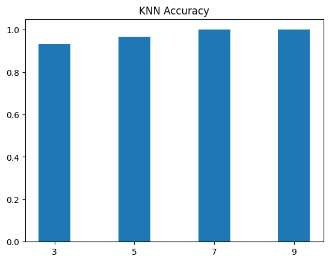
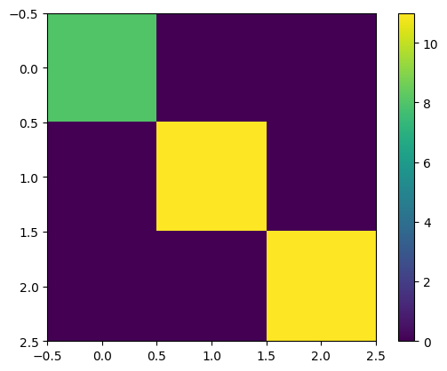
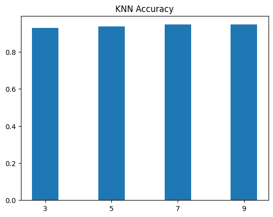
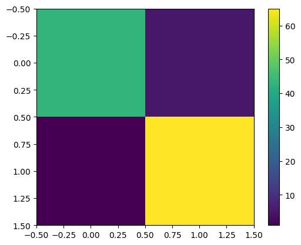

# KNN Algorithm training

KNN stands for "K-Nearest Neighbors," and it is a simple and popular machine learning algorithm used for both classification and regression tasks. It is considered a non-parametric and instance-based learning algorithm, meaning it doesn't make any assumptions about the underlying data distribution and stores the entire training dataset to make predictions.

In KNN, the "K" refers to the number of nearest neighbors that will influence the prediction for a new data point. When making a prediction for a new data point, the algorithm looks at the K closest data points (neighbors) in the training set based on some distance metric (usually Euclidean distance) and determines the majority class (in classification) or the average value (in regression) of these neighbors to assign a label or value to the new data point.

To find out more visit [sklearn.neighbors](https://scikit-learn.org/stable/modules/generated/sklearn.neighbors.KNeighborsClassifier.html) website . 

---
---

## usage 

First install scikit-learn library
```
pip install scikit-learn
```

then import KNN algorithm from it using 
```
from sklearn.neighbors import KNeighborsClassifier 
```

---
---

### FIRST PROJECT: IRIS_Dataset

This picture shows the accuracy of my KNN Algorithm using multiple neighbors. 



Here is the Confusion Matrix of my dataset



---
---
### SECOND PROJECT: Breast_Cancer_Dataset

This picture shows the accuracy of my KNN Algorithm using multiple neighbors.




Here is the Confusion Matrix of my dataset



---
---

